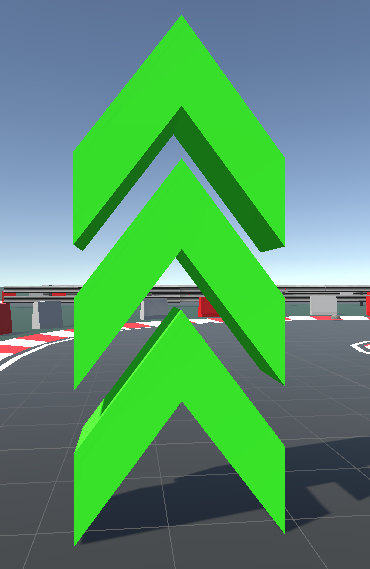
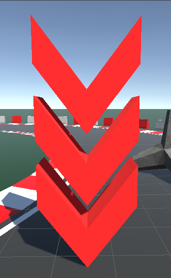
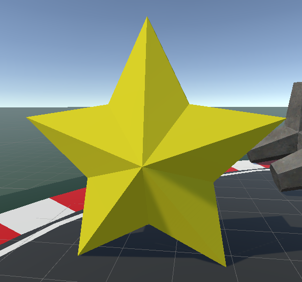
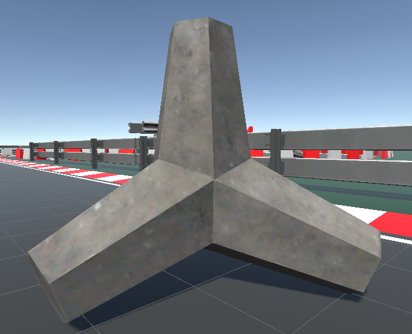
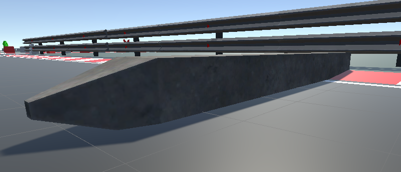
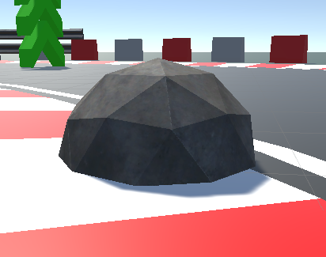
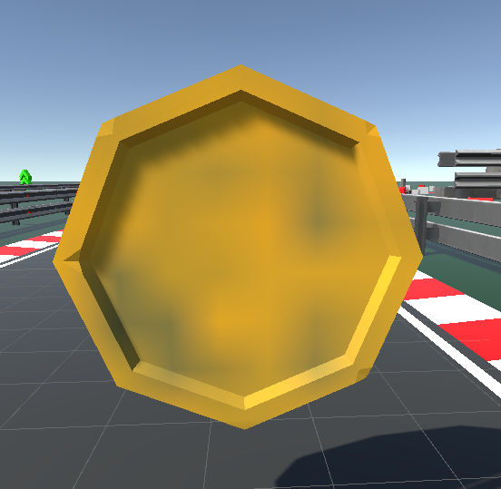
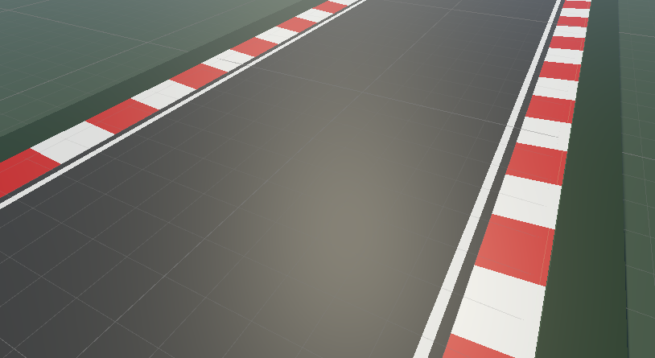

# Racing Game "World of Speed" on Unity

This game is a racing arcade where the player must complete five levels, dodging obstacles and reaching the finish line.

## Installation Instructions

1. Download and install Unity if you don't have it on your computer.
2. Download the game files from the GitHub repository.
3. Open the project in Unity.
4. Ready to play!

## Gameplay Instructions

1. Click the "Play" button in the menu to start the game.
2. Choose the difficulty level and try to complete it perfectly. Your progress will be saved and visible in the menu.
3. Use the `W` and `S` keys to control the car forward and backward, respectively.
4. Use the `A` and `D` keys to steer the car left and right, respectively.
5. Avoid obstacles along the way and reach the finish line of each level.
6. Complete all five levels to win the game! To access the next level, you must complete the previous one with at least one star.
7. A pleasant bonus awaits you at the end.

## Game Objects

The following objects can be found in the game:

1. **Booster** - speeds up the car.

2. **Antibooster** - slows down the car.

3. **Star** - level end marker.

4. **Bumpers** - objects to avoid colliding with.

5. **Coin** - collect coins during the game; your result depends on them.

6. **Track** - stay within the track boundaries; otherwise, the level restarts.

## Levels and Progress

Levels are included in the game menu. To play the next level, you need to complete the previous one with at least one star. Progress is saved and displayed in the menu.

## Shop and Skins

The game "World of Speed" also features a shop where players can use coins earned in levels to purchase various skins and additional elements. The shop offers unique car color variations, different decals, airbrush designs, as well as modifications to the appearance and functionality of the cars.

## Reset Button

The game includes a "Reset" button that resets the game progress, allowing you to start over.

## Exit Button

The game also contains an "Exit" button that allows you to exit the game.

## File Description

- `Assets/` - folder containing game resources, such as images and sound effects.
- `Assets/Scenes/` - folder containing game level files.
- `Assets/Resources/` - folder containing resource files used in the game's code.
- `Assets/Sounds/` - folder containing game sound files.
- `Assets/Scripts/` - folder containing script files that control the game's behavior.
- `README.md` - the file you are currently reading, providing information about the project.
- `Assets/Textures/` - folder containing game texture files.
- `Assets/Fonts/` - folder containing game fonts.
- `Assets/Photos/` - folder containing game backgrounds and other images.

## Sounds Folder

`Assets/Sounds/` is the folder in your project where sound files used in the game are located. You can place sound effects, music files, or any other

 audio files that need to be played in the game.

For example, if you have a sound effect for collecting a coin...

## Contact

If you have any questions or issues with the game, please contact me via email: mai.batsiev.oleg@gmail.com.

## Credits

All textures, images, and other resources used in the game "World of Speed" were taken from open sources and provided for free use.
